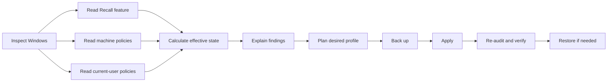
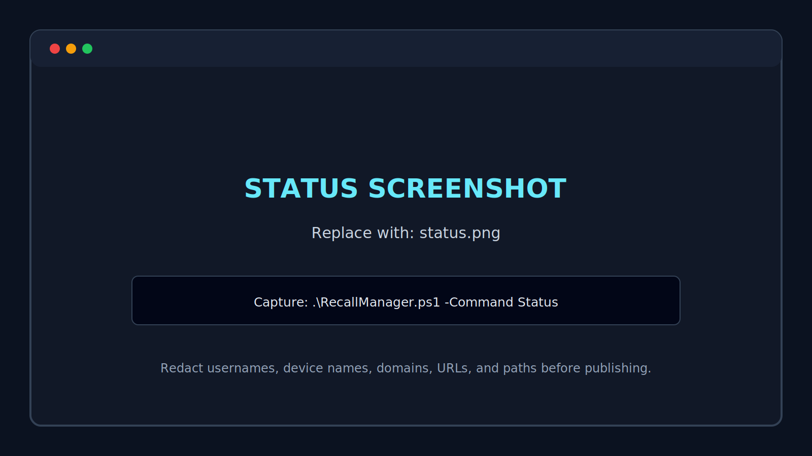
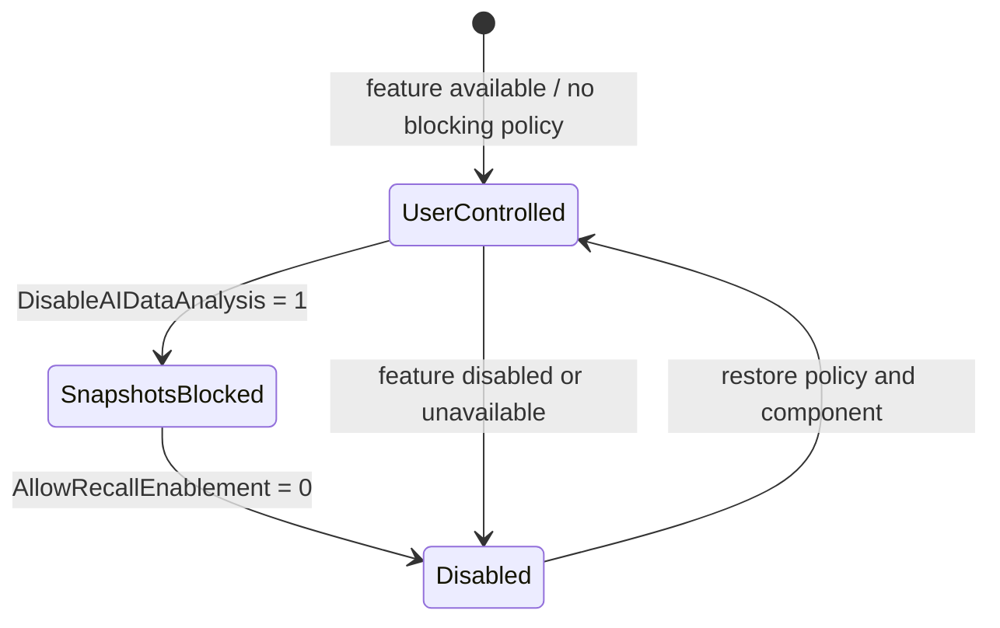

# RecallManager

[](LICENSE)
[](https://www.microsoft.com/windows)
[](https://learn.microsoft.com/powershell/)
[](CHANGELOG.md)

**RecallManager audits, explains, configures, verifies, and rolls back the Windows Recall privacy state.**

This v1 beta turns the original one-question DISM toggle into a state-aware management tool for individual users, support engineers, endpoint administrators, and automation workflows.

> [!IMPORTANT]
> This branch is a pre-release launch candidate. Test it on a supported non-production Windows 11 device before considering a merge or public release.

## Why RecallManager exists

Recall can be affected by multiple layers: Windows eligibility, optional-feature state, device policy, user policy, user opt-in, and pending restarts. A feature flag alone does not explain the effective state.

RecallManager builds a normalized view and answers:

- Is the optional component present, enabled, disabled, removed, or unavailable?
- Are machine or current-user policies blocking availability or snapshot saving?
- Which setting wins when states disagree?
- What exact changes would a privacy profile make?
- Can the prior configuration be restored?



## Screenshot preview

The launch documentation already contains replaceable screenshot frames. Capture the real UI after testing and overwrite the matching files.



See [Screenshot Capture Guide](docs/screenshots.md) for the required shots and redaction checklist.

## Profiles

| Profile | Purpose | Component change | Snapshot policy |
|---|---|---:|---:|
| `AuditOnly` | Inspect without changes | None | None |
| `UserControlled` | Remove RecallManager policy overrides | None | Return to Windows/user control |
| `SnapshotsOff` | Keep the component but block snapshots | None | Blocked at machine and current-user scope |
| `PrivacyHardened` | Maximum supported local hardening | Disable and remove | Availability and snapshots blocked |

> [!WARNING]
> Microsoft documents that disabling Recall availability or turning off snapshot saving can delete previously saved snapshots. `SnapshotsOff` and `PrivacyHardened` are therefore marked destructive and require confirmation unless explicitly automated.

## Quick start

Open **PowerShell as Administrator** for changes. Status and audit commands can run without elevation.

```powershell
git clone https://github.com/antonflor/RecallManager.git
cd RecallManager

# Human-readable status
.\RecallManager.ps1 -Command Status

# Full privacy audit
.\RecallManager.ps1 -Command Audit

# Preview every intended change
.\RecallManager.ps1 -Command Plan -Profile PrivacyHardened

# PowerShell's native WhatIf preview
.\RecallManager.ps1 -Command Apply -Profile PrivacyHardened -Preview

# Apply after review
.\RecallManager.ps1 -Command Apply -Profile PrivacyHardened

# Restore the most recent RecallManager backup
.\RecallManager.ps1 -Command Restore
```

## Automation examples

```powershell
# JSON for RMM, Intune, or another collector
.\RecallManager.ps1 -Command Audit -Format Json

# Write an audit artifact
.\RecallManager.ps1 -Command Export -OutputPath C:\Temp\recall-audit.json

# Noninteractive enforcement after testing
.\RecallManager.ps1 -Command Apply -Profile SnapshotsOff -Yes
```

## Effective-state model



RecallManager intentionally does **not** attempt to read Recall snapshot contents. Microsoft protects snapshot access with Windows Hello and user-scoped encryption; this tool manages supported feature and policy surfaces instead.

## Repository map

```text
RecallManager.ps1                  CLI and interactive entry point
config/profiles.json               Desired-state profile definitions
src/RecallManager/                 PowerShell module
  Public/                          Supported commands
  Private/                         Detection, policy, feature, and backup logic
tests/                             Pester tests
docs/                              Architecture, profiles, screenshots, testing, and future-site handoff
.github/workflows/test.yml         Windows validation pipeline
```

## Future public website

A public project website is planned for **`recall-manager.net`**, but website implementation is deliberately deferred until the application has been tested and is ready for launch. Its code will live in a separate repository that remains private during development.

RecallManager remains free, open source, community-first, and ad-free. Advertising, monetization, paid tiers, accounts, and website implementation are not part of this application repository or the current v1 beta.

See [Future website handoff](docs/future-website-handoff.md) for the preserved product direction, repository boundary, sitemap, launch gate, and later cleanup plan.

## Documentation

- [Architecture](docs/architecture.md)
- [Profiles and safety behavior](docs/profiles.md)
- [Screenshot Capture Guide](docs/screenshots.md)
- [Testing and launch checklist](docs/testing.md)
- [Windows policy reference](docs/windows-policy-reference.md)
- [Future recall-manager.net website handoff](docs/future-website-handoff.md)
- [Contributing](CONTRIBUTING.md)
- [Security policy](SECURITY.md)

## Current v1 beta boundaries

- Windows 11 only; Recall itself requires eligible Copilot+ hardware and supported builds.
- Local machine and current-user policy inspection only.
- Enterprise/MDM reporting is informational; RecallManager does not replace Intune or Group Policy management.
- Snapshot contents and encrypted databases are never opened.
- No graphical desktop application yet. The PowerShell module is designed to become the shared engine for a future GUI.

## License

MIT. See [LICENSE](LICENSE).