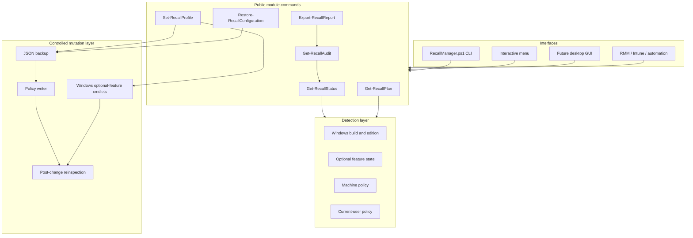
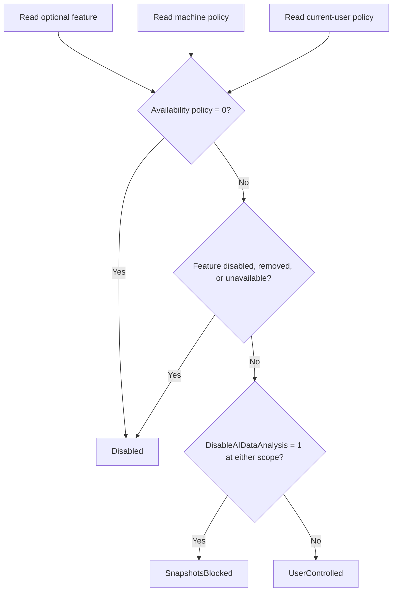
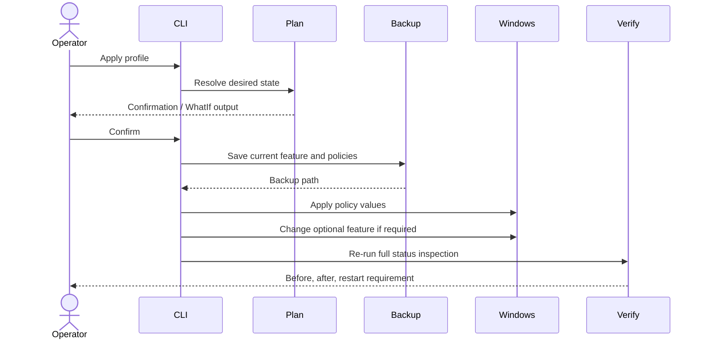

# Architecture

RecallManager separates inspection, reasoning, planning, mutation, verification, and presentation. The PowerShell module is the product engine; the current CLI and any future desktop interface should call the same exported commands.

## Component model

## Effective-state evaluation

The optional feature and policy layers can disagree. RecallManager normalizes them into one of three operator-facing states.

`UserControlled` does not mean snapshots are actively being saved. Microsoft requires user opt-in; it means RecallManager did not detect a blocking policy or unavailable component.

## Change transaction

## Data boundaries

RecallManager reads configuration metadata only:

- Windows version and edition;
- Recall optional-feature state;
- documented Windows AI policy values;
- RecallManager-created backup metadata.

It does not read or decrypt Recall snapshots, search indexes, databases, exported snapshot packages, or Windows Hello-protected content.

## Extension points

The module can later support:

- a WinUI or WPF frontend;
- fleet-oriented compliance output;
- signed PowerShell Gallery releases;
- richer edition/build compatibility rules;
- policy conflict provenance from domain policy or MDM;
- approved app and URI exclusion management;
- event log integration.
