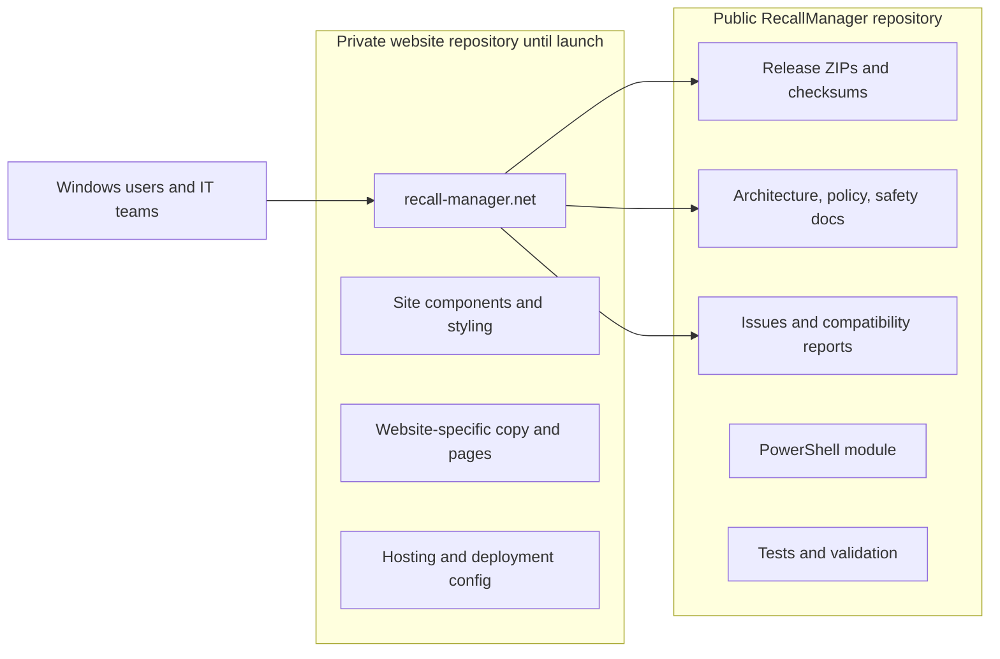
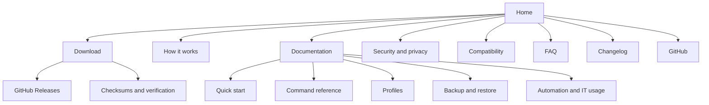
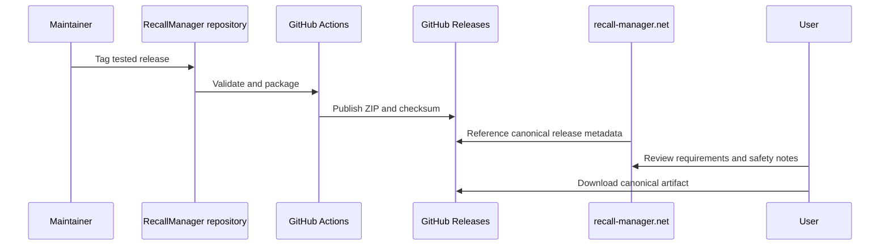
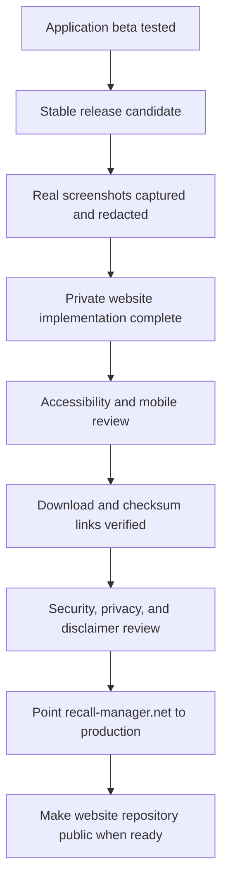

# Future website handoff: recall-manager.net

This document preserves the decisions and launch context for the future RecallManager website. It is intentionally a planning handoff only; website code does not belong in this repository.

## Decisions already made

- **Domain:** `recall-manager.net`
- **Product:** RecallManager
- **Software model:** free, open source, community-first, and ad-free
- **Website model:** public informational and documentation site
- **Website repository:** separate repository, kept private until launch readiness
- **Monetization:** not part of the product or website plan; advertising and AdSense work are parked indefinitely
- **Application repository:** remains the canonical source for the PowerShell module, tests, releases, checksums, technical behavior, and security policy

The website should strengthen trust in the project, make the tool easier to understand, and help Windows users safely evaluate Recall configuration. It should not turn the application into a commercial product or introduce advertising into the application.

## Product positioning

**Primary headline:** Know what Windows Recall is actually doing.

**Primary description:** RecallManager is a free, open-source Windows utility that audits, explains, configures, verifies, and restores Microsoft Recall settings.

Core trust statements:

- free and open source;
- no account required;
- no advertising in the application;
- no telemetry by default;
- no Recall snapshot inspection;
- every planned change is visible before application;
- configuration is backed up before changes;
- supported changes can be restored;
- source, releases, checksums, and known limitations are public.

Avoid fear-based privacy marketing. The project should explain what Windows reports, show how settings interact, and let users make an informed choice.

## Repository boundary

### RecallManager application repository owns

- PowerShell source and module manifest;
- profile definitions;
- tests and analysis configuration;
- release packaging and checksums;
- architecture and policy behavior;
- security policy and disclosures;
- compatibility information derived from tested releases;
- GitHub issues and community contributions.

### Future website repository owns

- website framework and components;
- branding implementation and visual assets;
- landing-page and website-specific copy;
- navigation, accessibility, responsive behavior, and metadata;
- deployment configuration;
- domain configuration documentation;
- public documentation presentation or generated documentation shell;
- website-only analytics, if the project ever deliberately adopts privacy-respecting analytics.

The website repository must not become a second source of truth for application behavior. Technical statements should link to, generate from, or be reviewed against the public application repository.

## Proposed site map

Recommended initial pages:

1. `/` — product explanation, trust boundaries, screenshots, and GitHub/download calls to action;
2. `/download` — current stable or beta release, checksum verification, requirements, and release notes;
3. `/docs` — documentation index;
4. `/docs/getting-started` — installation and first audit;
5. `/docs/profiles` — profile behavior and destructive-change warnings;
6. `/docs/backup-and-restore` — backup location, restore behavior, and limitations;
7. `/security` — threat boundaries, reporting process, and snapshot-content non-access statement;
8. `/compatibility` — tested Windows builds and hardware outcomes;
9. `/faq` — common user and administrator questions;
10. `/changelog` — release history sourced from the application repository;
11. `/about` — project purpose and maintainer information;
12. `/privacy` — website privacy statement, even when no analytics are enabled.

## Download and release rules

The website should direct downloads to canonical GitHub Releases rather than maintain an independent binary mirror. This prevents the site and source repository from serving different builds.

Every displayed release should include:

- version and release channel;
- publication date;
- supported Windows requirements;
- link to release notes;
- direct GitHub Release asset link;
- SHA-256 checksum;
- signing status when code signing is introduced;
- clear beta or prerelease labeling.

## Visual direction

- Windows-native but clearly independent from Microsoft;
- dark navy, neutral gray, restrained cyan, and warning amber;
- clean sans-serif typography with monospace for commands and state values;
- state chips such as `User Controlled`, `Snapshots Blocked`, `Disabled`, and `Restart Required`;
- terminal output, diagrams, and verified state transitions instead of generic shield imagery;
- accessible contrast, visible focus states, reduced-motion support, and mobile-first layouts;
- no fake warnings, countdowns, scare copy, or oversized download prompts.

## Existing launch assets in this repository

These files are temporary references for the future website repository:

- `docs/images/status-placeholder.svg`
- `docs/images/audit-placeholder.svg`
- `docs/images/plan-placeholder.svg`
- `docs/images/social-card-placeholder.svg`
- `docs/screenshots.md`

Real captures should use the stable filenames defined in `docs/screenshots.md`. Screenshots must be taken from tested builds and reviewed for usernames, hostnames, paths, serial numbers, and other personal information.

## Private website repository bootstrap

When website work begins:

1. Create a new private repository for the site.
2. Copy this document into that repository as the initial product brief.
3. Copy only website-specific placeholder assets that are still useful.
4. Add a link back to the public RecallManager repository.
5. Keep deployment secrets out of source control and provide only a sanitized `.env.example` when needed.
6. Use preview deployments while the repository remains private.
7. Add branch protection, dependency updates, accessibility checks, and link validation before launch.
8. Do not publish the repository or point production DNS at it until the launch checklist is complete.

No website framework, hosting provider, analytics platform, or DNS layout is selected by this document. Those decisions should be made when implementation begins rather than prematurely locking the project to a stack.

## Public launch gate

Minimum launch conditions:

- a tested RecallManager release exists;
- the website links to the correct release and checksum;
- all placeholder screenshots have been replaced;
- compatibility claims are based on recorded testing;
- the security and privacy pages match actual behavior;
- the site includes a clear statement that RecallManager is an independent open-source project and is not affiliated with or endorsed by Microsoft;
- all navigation, download, and external links have been tested;
- no secrets, private preview URLs, internal notes, or personal machine data are present.

## Cleanup in this repository after website launch

Once the separate website repository is established, review this application repository and remove planning-only duplication.

| Item | Expected action after website launch |
|---|---|
| This handoff document | Remove or reduce to a short link to the website repository |
| Social-card placeholder | Move final source asset to the website repository |
| Website-only visual planning | Move to the website repository |
| Technical screenshots used by README/docs | Keep when they help application users |
| Screenshot capture requirements | Keep if releases still depend on them |
| Architecture, profiles, policy, testing, and security docs | Keep as canonical application documentation |
| Release workflows and checksums | Keep in the application repository |

The cleanup should happen only after the website repository has retained the needed history and assets.

## Explicitly out of scope

- advertising or AdSense integration;
- monetization requirements;
- paid application tiers;
- accounts, subscriptions, license keys, or feature gating;
- advertisements, sponsor prompts, or donation nags inside RecallManager;
- collecting or uploading Recall snapshot contents;
- silently installing software from the website;
- maintaining a separate release build outside GitHub Releases.

## Future implementation kickoff

When website development begins, use this document together with:

- `README.md` for current positioning and commands;
- `docs/architecture.md` for the effective-state model;
- `docs/profiles.md` for profile safety behavior;
- `docs/screenshots.md` for required captures;
- `docs/testing.md` for release readiness;
- `SECURITY.md` for security boundaries;
- `CHANGELOG.md` for release history.

The first website milestone should be a private, deployable documentation and download site for `recall-manager.net`—not a redesign of the RecallManager application.