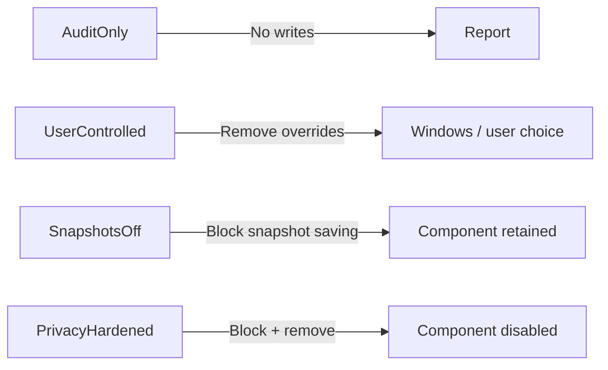

# Profiles and safety behavior

Profiles are declarative desired states stored in `config/profiles.json`. The module turns the profile into a plan, backs up the current configuration, applies only the requested differences, and reinspects Windows.



## AuditOnly

Use for inventory, support intake, troubleshooting, and compliance collection. It never writes settings and does not require administrator rights.

## UserControlled

Removes policy values managed by RecallManager:

- machine `AllowRecallEnablement`;
- machine `DisableAIDataAnalysis`;
- current-user `DisableAIDataAnalysis`.

It does not automatically enable the optional feature. This profile is intentionally conservative: it returns the policy surface to Windows/user control rather than forcing Recall on.

## SnapshotsOff

Sets `DisableAIDataAnalysis` to `1` at machine and current-user scope while leaving the optional feature unchanged.

Microsoft documents that enabling the policy named **Turn off saving snapshots for Recall** prevents saving snapshots and can delete snapshots that were previously saved. Treat this as a destructive profile even though it does not remove the component.

## PrivacyHardened

Sets:

- machine `AllowRecallEnablement` to `0`;
- machine and current-user `DisableAIDataAnalysis` to `1`;
- Recall optional feature to disabled with payload removal.

This profile can require a restart. Microsoft documents that disabling Recall availability removes the component and deletes previously saved snapshots.

## Confirmation model

| Invocation | Behavior |
|---|---|
| `Plan` | Displays intended changes only |
| `Apply -Preview` | Uses PowerShell `WhatIf`; no changes |
| `Apply` | Prompts before applying |
| `Apply -Yes` | Noninteractive; intended only after testing |
| `Restore` | Prompts before restoring latest backup |

## Backups

Backups are written under:

```text
%ProgramData%\RecallManager\Backups
```

They contain feature state and policy metadata, not Recall snapshot contents. A backup can restore policy values and attempt to restore the optional-feature state. If feature payload was removed, Windows may need Windows Update or another servicing source to enable it again.
