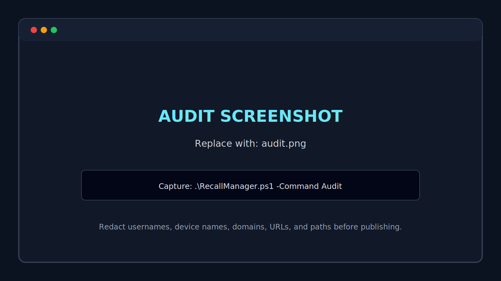
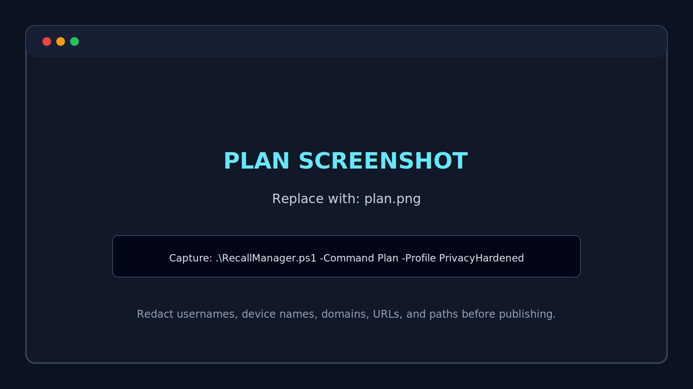

# Screenshot Capture Guide

The repository includes SVG placeholders so the documentation has stable image paths before real screenshots are available. Replace each placeholder with a PNG using the filename below, then update the Markdown extension from `.svg` to `.png` where referenced.

## Required launch screenshots

### 1. Status overview

Placeholder: `docs/images/status-placeholder.svg`  
Final asset: `docs/images/status.png`

Capture:

```powershell
.\RecallManager.ps1 -Command Status
```

Include the effective state, explanation, optional-feature state, and administrator status.


### 2. Privacy audit

Placeholder: `docs/images/audit-placeholder.svg`  
Final asset: `docs/images/audit.png`

Capture:

```powershell
.\RecallManager.ps1 -Command Audit
```

Show the privacy score, configured policies, findings, and recommendations.



### 3. Change plan

Placeholder: `docs/images/plan-placeholder.svg`  
Final asset: `docs/images/plan.png`

Capture:

```powershell
.\RecallManager.ps1 -Command Plan -Profile PrivacyHardened
```

Show the destructive warning, backup step, policy changes, optional-feature action, and verification step.



### 4. WhatIf preview

Final asset: `docs/images/whatif.png`

```powershell
.\RecallManager.ps1 -Command Apply -Profile PrivacyHardened -Preview
```

### 5. Successful application and restart notice

Final asset: `docs/images/applied.png`

Use a supported test machine. Show the before state, after state, backup path, verification result, and restart requirement.

## Capture standards

- Use Windows Terminal with a clean PowerShell profile.
- Use a 16:9 or 3:2 crop, at least 1600 pixels wide.
- Keep the same terminal dimensions and font across all screenshots.
- Use Windows dark mode or a neutral terminal theme.
- Redact computer names, usernames, domains, filtered URLs, application names, and backup paths when sensitive.
- Do not show Recall snapshot content.
- Prefer PNG for terminal screenshots and SVG for diagrams or product illustrations.
