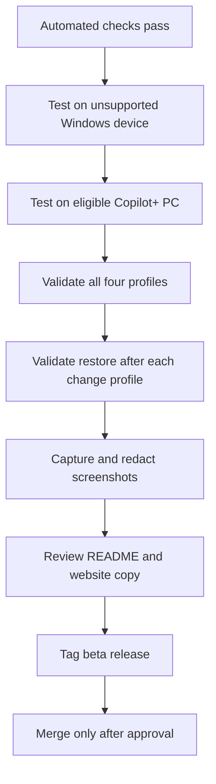

# Testing and launch checklist

This branch should remain separate from `main` until the following checks pass on real Windows hardware.

## Automated checks

```powershell
Install-Module Pester -Force -Scope CurrentUser
Install-Module PSScriptAnalyzer -Force -Scope CurrentUser

Invoke-ScriptAnalyzer -Path . -Recurse -Severity Warning,Error
Invoke-Pester -Path .\tests -Output Detailed
```

The GitHub Actions workflow runs the same classes of checks on `windows-latest`.

## Manual test matrix

| Scenario | Expected result |
|---|---|
| Non-elevated `Status` | Completes successfully |
| Non-elevated `Audit` | Completes successfully |
| Non-elevated `Apply` | Fails with a clear elevation message |
| Unsupported/non-Copilot+ device | Reports feature unavailable without crashing |
| `Plan -Profile SnapshotsOff` | No writes; lists backup, policies, and verification |
| `Apply -Preview` | Native WhatIf output; no registry or feature changes |
| `SnapshotsOff` | Policies written, component unchanged, audit says SnapshotsBlocked or Disabled |
| `PrivacyHardened` | Policies written, feature disabled/removed, restart surfaced |
| `Restore` | Restores policy values from the latest backup |
| JSON output | Valid JSON with no terminal formatting artifacts |

## Release gate



## High-risk checks

- Confirm `SnapshotsOff` behavior against current Microsoft documentation and the installed Windows build.
- Confirm whether existing snapshots are deleted by policy on the test device.
- Confirm feature removal and restoration with and without network access.
- Confirm domain or MDM policy does not immediately overwrite local values.
- Inspect backup permissions under `%ProgramData%\RecallManager\Backups`.
- Confirm a pending restart is clearly reported.

## Suggested beta label

`v1.0.0-beta.1`

Do not publish a stable `v1.0.0` tag until supported-device testing and restore testing are complete.
