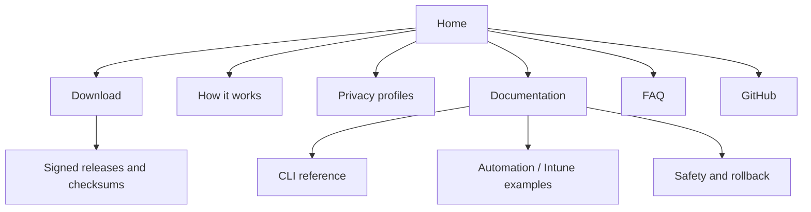

# Website and product launch brief

RecallManager can support a small focused product site without becoming a commercial security suite. The site should explain the effective-state problem, show the audit/plan workflow, document safety boundaries, and direct users to GitHub releases.

## Positioning

**Headline:** Know what Windows Recall is actually doing.  
**Subheadline:** Audit, explain, harden, verify, and restore Windows Recall configuration with an open-source PowerShell tool.

Primary audience:

- privacy-conscious Windows users;
- desktop support and MSP engineers;
- endpoint and infrastructure engineers;
- security teams evaluating Copilot+ PCs.

## Site map

## Home page sections

1. **Hero** — one-line promise, GitHub/download button, status screenshot.
2. **The problem** — feature, policy, user choice, and restart state can disagree.
3. **The workflow** — Audit → Explain → Plan → Back up → Apply → Verify → Restore.
4. **Profiles** — cards for AuditOnly, UserControlled, SnapshotsOff, PrivacyHardened.
5. **Transparency** — no snapshot inspection, no telemetry, open source, reversible changes.
6. **Screenshots** — status, audit, plan, WhatIf, successful apply.
7. **For IT** — JSON output, predictable commands, GitHub Actions validation.
8. **FAQ** — eligibility, snapshots, admin rights, restore behavior, managed devices.
9. **Final CTA** — view source, inspect the plan, test the beta.

## Visual direction

- Windows-native but independent: dark navy, neutral gray, cyan accents, warning amber.
- Monospace details paired with a clean sans-serif interface font.
- Use state chips: `User Controlled`, `Snapshots Blocked`, `Disabled`, `Restart Required`.
- Avoid fear-based imagery. Show transparent state, plans, and verification.
- Use Mermaid diagrams in docs and purpose-built SVG illustrations on the marketing site.

## Launch assets needed

- square project icon;
- horizontal wordmark;
- social preview card (1200×630);
- five tested/redacted screenshots;
- 30-second terminal demo GIF or MP4;
- beta release notes;
- checksums and, later, code-signing information.

## Suggested domains and naming

Keep the product name `RecallManager`. Suitable site patterns include:

- `recallmanager.dev`
- `recallmanager.app`
- a project page under `tonyflor.me`
- GitHub Pages from this repository

Domain availability must be checked before purchase.

## Launch sequence

1. Test this branch on unsupported and supported Windows hardware.
2. Capture screenshots using `docs/screenshots.md`.
3. Publish `v1.0.0-beta.1` as a GitHub prerelease.
4. Launch a one-page site linked to the prerelease.
5. Collect issues and compatibility reports.
6. Add signing and packaged releases before stable v1.
